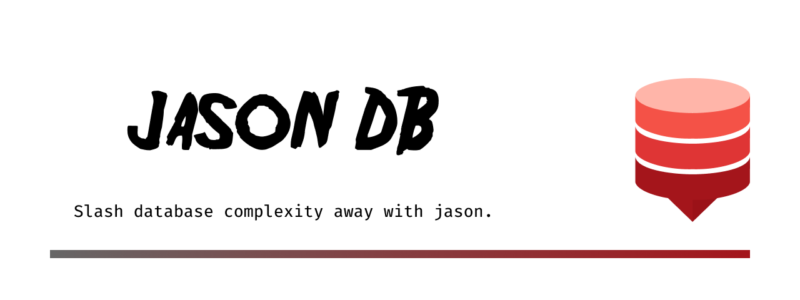

# jason db 📦



[](https://opensource.org/licenses/mit-license.php)
[](http://makeapullrequest.com)
[](https://github.com/your/repo/graphs/commit-activity)
[](https://bun.sh)

[](https://www.typescriptlang.org/)


> 🚀 A simple, lightweight, and embeddable JSON database built with Bun

jason is the perfect solution when you need a fast and easy-to-use JSON database in your Bun projects. With features like schema validation, concurrency control, and built-in caching, it provides everything you need in a simple package.

## ✨ Highlights

- 📝 **Simple API** - CRUD and query JSON documents with just a few lines of code
- 🪶 **Lightweight & Embeddable** - Easy integration without adding bloat to your project
- ✅ **Schema Validation** - Ensure your data integrity
- 🔒 **Concurrency Control** - Prevent update conflicts
- 📚 **Versioning Support** - Track document changes
- ⚡ **Built-in Caching** - Improve read performance
- 🔍 **Query System** - Find documents with custom criteria

## 🚀 Installation

```sh
bun add @aurios/jason

# or

npm i @aurios/jason
```

## 💻 Quick Example

```typescript
import { createJasonDB } from "@aurios/jason";

// Initialize the database
const db = await createJasonDB({
  base_path: "./my-db",
  collections: {
    // Define schema using the simple string syntax
    users: "name;email;age:number;isActive:boolean"
  }
});

const { users } = db.collections;

// Create a document
await users.create({
  name: "John Smith",
  email: "john@example.com",
  age: 30,
  isActive: true
});

// Find documents
const adults = await users.find({
  where: { 
    age: { _tag: "gte", value: 18 } 
  }
});
```

## 🛠️ Core API

### 📦 Initialization

Use `createJasonDB` to initialize your database instance. You define your collections and their schemas in the configuration.

```typescript
const db = await createJasonDB({
  base_path: "./data", // Directory to store data
  collections: {
    // String syntax: "field1;field2:type;..."
    posts: "@id;title;content;published:boolean;*tags",
    // You can also use Effect Schema objects if preferred
    // users: Schema.Struct({ ... })
  }
});
```

### 📝 Schema String Syntax

The string syntax provides a shorthand for defining fields and indexes:

*   **Format**: `name:type` (type defaults to string if omitted)
*   **Types**: `string`, `number`, `boolean`, `date`, `array<T>`, `record<K,V>`
*   **Modifiers**:
    *   `@id`: UUID Primary Key
    *   `++id`: Auto-increment Primary Key
    *   `&name`: Unique Index
    *   `*tags`: Multi-entry Index (for arrays)
    *   `[a+b]`: Compound Index

### 📑 Collection Operations

Access collections via `db.collections.<name>`.

```typescript
const collection = db.collections.posts;

// Create
const post = await collection.create({ 
  title: "Hello World", 
  tags: ["news", "tech"] 
});

// Read (by ID)
const item = await collection.findById(post.id);

// Update
await collection.update(post.id, { title: "Updated Title" });

// Delete
await collection.delete(post.id);

// Check existence
const exists = await collection.has(post.id);
```

### 🔍 Querying

Use `find` or `findOne` with a rich query language.

```typescript
// Simple equality
const results = await collection.find({
  where: { published: true }
});

// Comparison operators
// Available tags: eq, ne, gt, gte, lt, lte, in, nin, startsWith, regex
const recent = await collection.find({
  where: { 
    views: { _tag: "gt", value: 100 },
    title: { _tag: "startsWith", value: "How to" }
  },
  order_by: { field: "createdAt", order: "desc" },
  limit: 10
});

// Batch Operations
await collection.batch.insert([ ... ]);
await collection.batch.update({ category: "tech" }, { published: true });
await collection.batch.delete({ archived: true });
```

## 🤝 Contributing

Contributions are welcome!

1. 🍴 Fork the project
2. 🔧 Create your feature branch (`git checkout -b feature/AmazingFeature`)
3. 📝 Commit your changes (`git commit -m 'Add: amazing feature'`)
4. 📤 Push to the branch (`git push origin feature/AmazingFeature`)
5. 🔍 Open a Pull Request

## 🛠 Development

```sh
# Clone the repo
git clone https://github.com/realfakenerd/jason

# Install dependencies 
bun install

# Run tests
bun test

# Build project
bun run build

```

## 📄 License

Distributed under the [MIT License](../LICENSE)

---

⭐ If this project helped you, consider giving it a star!
📫 Questions? Open an issue or get in touch!
